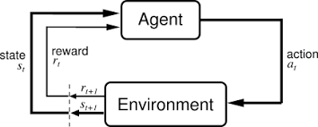

# ReinforcementLearning
A Short notes of the course CS6700 that I took at uni in the Spring of 2022. 
## OpenAI Gym

A toolkit for devloping and comparing RL algorith,s with multiple bencmark environemnts

`pip install gym`

## Setting up the environement

### Terms and Definitions

RL agent that interacts with its environemt in discrete timesteps.

For each time step:

1. state **st** of the environment
2. chooses an action **at** according to its **policy**
3. reward **rt+1** for its action
4. environment transitioned into the next state **st+1**

**Episode** - A collection of steps that terminates when the agent fails to achieve the goal, or the episode reaches the maximum number of allowed steps.

**Render** - Gym can render one frame for display after each edpisode.

**Nondeterministic** - For some environemnts, randomness is a factor in deciding what effects actions have on reward and changes to the observation space.

Some more prperties of action space :

**action space**: What actions can we take on the environment, at each step/episode, to alter the environment.

**observation space**: What is the current state of the portion of the environment that we can observe.

### Code Terms

| Code      | Description |
| :---        |    :----:   |    
| `env`      | Environment Variable       | 
| `env.action_space`  | Returns the action space |
| `env.observation_space` | Returns the observation space |
| `env.reward_range` | Returns the reward range | 
| `env.reset()` | Resets the environment to the starting state |
| `env.action_space.sample()` | Returns a random action from the action space |
| `env.step(action)` | Takes a step in the environment with the given action, returns {next_observation, reward, done, _ } |
| `env.render()` | Renders the environemt |
| `env.close()` | Closes the environment | 
| `agent.act(state)` | Returns an action from the agents policy |

**Additional Information on Spaces** 

* Action space and observation spaes are represented using data structures called `Spaces`( `gym.Space` base class )

* Spaces can be `Box` or `Discrete`

* Box(n,)

    * n-dimentional contionus space, eg. in 2D, n = 2
    * `env.observation_space.high` and `env.observation_space.low` give the legimate upper and lower limits the space can take

* Discrete(n,)

    * Discrete space with `n` valeus from 0 to n-1. No high and low